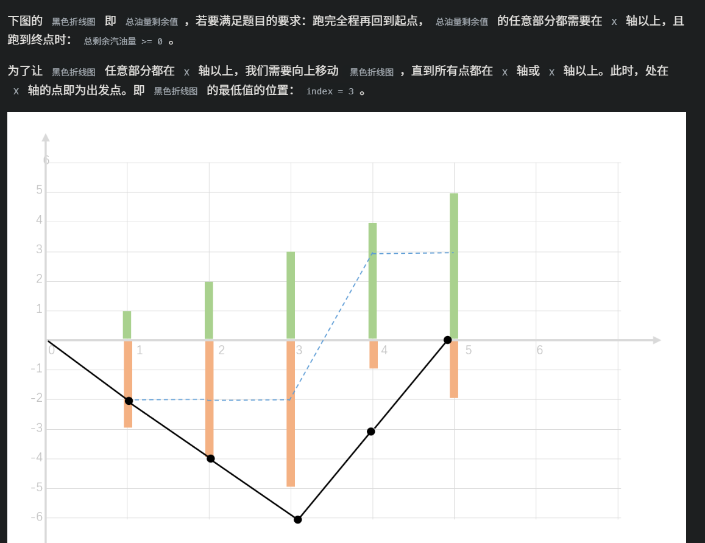

# Algorithm
算法题题解
some solutions to algorithm problems
## AcWing 1083. Windy数 
https://www.acwing.com/problem/content/1085/

**1** f[i][j]表示从最高位为第i位，且最高位填的数字是j的方案数。

**2** 这道题有前导零和无前导零的情况要分开处理，因为虽然013和13本质上都表示13这个数，但是按照我们这道题的DP初始化方式，013并不会被计入res当中，只有13会，因此我们需要将有前导零的情况特殊处理，以防止res偏小。

**3** 特殊处理时为什么要写成

*1*
```
for(int i = len - 1; i > 0; i --)
     for(int j = i != 1; j <= 9; j ++)
      res += f[i][j];
    return res;
```

而不是

*2*
```
for(int i = len - 1; i > 0; i --)
     for(int j = 1; j <= 9; j ++)
      res += f[i][j];
    return res;
```

因为我们在solve函数的开头有`if(!x) return 1;` 这是把0计入windy数的，倘若我们写成*2*那样，就会把0漏掉，虽然能避免错误地出现前导零，但还是会在最后造成答案错误。
## 1084. 数字游戏 II
https://www.acwing.com/problem/content/description/1086/

这道题整体上和数字游戏Ⅰ基本相同，本题中dp数组f[i][j][k]表示一共有i位的数字，最高位填j，各位数字之和模n为k时的方案数，整体逻辑框架与Windy数相同。

## 蓝桥杯2023 省赛 颜色平衡树
http://oj.ecustacm.cn/problem.php?id=2071
启发式合并模板题，启发式合并学习链接：https://zhuanlan.zhihu.com/p/560661911

## 蓝桥杯2023 省赛 买瓜
http://oj.ecustacm.cn/problem.php?id=2072
meet in the middle算法，洛谷题解链接：https://www.luogu.com.cn/problem/solution/P9234

## 蓝桥杯2023 省赛 异或和之和
https://www.luogu.com.cn/problem/P9236
经典题，洛谷题解链接：https://www.luogu.com.cn/problem/solution/P9236
w[i][j]表示在所有前缀和当中，第i位上j的个数，j只能取0或者1，注意在初始化w数组时，要把s[0]也算上，因为有从形式如[1,r]的区间存在。

## codeforces Educational Codeforces Round 151 (Rated for Div. 2) D. Rating System

https://codeforces.com/contest/1845/problem/D
首先通过前缀和求出前x个数的总和，通过题目可以想到k的取值为每场比赛过后的评分。通过逆向思维，想要求出最终的评分最大，则要求出这个k能够帮你提升评分的最大值。假设，则此后每一轮比赛过后能够提升评分的值为。
因此，假设当前进行到了第x场比赛，则能够提升评分的最大值为max{sum[0],sum[1]...sum[x-1]} - sum[x]。 所以，我们可以遍历一遍整个sum数组，同时维护当前序列x的最大前缀和max_sum和最大能够提升的评分max_point = max_sum - sum[x] ,最终max_point 所对应的max_sum就是所要求的k

## codeforces Educational Codeforces Round 151 (Rated for Div. 2) A. Forbidden Integer

来源同上，一个简单的完全背包问题。

## ACwing 1086. 恨7不成妻

采用递归写法可以比采用循环写法简单很多。
数位DP的题目都遵循同一套思考逻辑，使用递归写法都较循环写法更加简单。

## ACwing 135. 最大子序和

这个题有两个值得注意的细节
1 为什么初始时tt是0而不是-1？
     因为初始时要加入s[0],例如最优解是1到i的所有数字之和，这时就应该计算s[i]-s[0]，所以一开始就要把s[0]加入进来。
2 为什么在42行不用判断队列是否为空？
     因为一开始就加入了s[0]，所以队列总是不可能为空。

## ACwing 1088. 旅行问题

前后做两次对称的单调队列优化DP，要尤其注意边界问题。

## ACwing 1089 烽火传递

一开始错误的地方：一开始默认把a[1]加入了单调队列，导致答案错误。
正解：一开始应该先放一个零在单调队列里，因为在第一个点燃的烽火台前面是没有烽火台被点燃的。

## AcWing 1090. 绿色通道

这道题就是上一道烽火传递+二分。

## AcWing 1087. 修剪草坪  

这道题反过来考虑先取最小值，再用总和减去最小值，就是和烽火传递一模一样的题目。

## ACwing 300. 任务安排1

这道题的细节在于会爆炸int，如果不把数组都定义成long long的话，需要把转移方程写成这样：
f[i] = min(f[i], f[j] + (LL) s * (c[n]- c[j]) + (LL) t[i] * (c[i] - c[j]));
因为t[]和c[]两个数字相乘可能会爆int，变成负数，所以要先转换成long long

## ACwomg 301. 任务安排2

这道题就是上一道题的斜率优化版本。

## ACwing 302. 任务安排3

这道题是上一道题的二分版本。
注意凸包的维护是
```
while (hh < tt && (double)(f[q[tt]] - f[q[tt - 1]]) * (c[i] - c[q[tt]]) >= (double) (c[q[tt]] - c[q[tt - 1]]) * (f[i] - f[q[tt]]))  tt--;
```
而不是
```
while (hh < tt && (double)(f[q[tt]] - f[q[tt - 1]]) * (c[i] - c[q[tt]]) > (double) (c[q[tt]] - c[q[tt - 1]]) * (f[i] - f[q[tt]]))tt--;
```
是大于等于而不是大于。

## ACwing 303.运输小猫

这道题的斜率优化采用的是二位状态f[i][j]，表示用i个饲养员，回收j只小猫的最优解。
前面的任务安排不需要把f数组初始化为正无穷，因为所有的f[i]都是从初始的f[0]转换而来，只要把f[0]设置为合法的初始值即可。
而这道题，正确的初始化应该是：
```
memset(f, 0x3f, sizeof f);
for (int i = 0; i <= p; i ++ ) f[i][0] = 0;

```
状态计算：
```
for (int i = 1; i <= m; i ++ )
        {
            while (hh < tt && (get_y(q[hh + 1], j) - get_y(q[hh], j)) <= a[i] * (q[hh + 1] - q[hh])) hh ++ ;
            int k = q[hh];
            f[j][i] = f[j - 1][k] - a[i] * k + s[k] + a[i] * i - s[i];
            while (hh < tt && (get_y(q[tt], j) - get_y(q[tt - 1], j)) * (i - q[tt]) >=
                (get_y(i, j) - get_y(q[tt], j)) * (q[tt] - q[tt - 1])) tt -- ;
            q[ ++ tt] = i;
        }

```
如果初始化时不加上memset的话，那么在计算f[1][i]时就会出错，因为计算f[1][i]时会调用f[0][k]，其中k不等于零，这个值是非法的，应该被设置为正无穷才对，但是因为我们没有初始化，所以f[1][i]直接由它转移而来，最终导致所有的f[][]计算结果均为零。

## AcWing 1097. 池塘计数

广搜flood fill模板提。

## AcWing 1098. 城堡问题

这种类型的题目要小心是m行n列还是n行m列。

## ACwing 1106. 山峰和山谷

这道题要注意广搜中的一个细节：
```
if(i == nx && j == ny) continue;
            if(i < 1 || i > n) continue;
            if(j < 1 || j > n) continue;
            if(w[i][j] != w[nx][ny])
            {
                if(w[i][j] > w[nx][ny]) is_peak = false;
                else is_valley = false;
                continue;
            }
            if(st[i][j]) continue;
```
在这一系列的判定条件中，不能把st的那个判定条件放在高度判定条件的前面，否则在计数最后一块没有被遍历的空地时，就会直接全部跳过高度判定，导致山峰数量和山谷数量同时加一。

## leetcode 11. Container With Most Water

首先不用想，这道题的正解显然是双指针。
一开始我的想法是把l,r的初始位置都放在0,然后一起向右移动,但是这个思路完全不可行，因为在指针移动过程中，h[l]和h[r]的变化是不确定的,区间的长度变化也是不确定的，可能l追r变小,也可能r远离l变大,根本无从下手.
于是我想到,把l和r分别放在0和n - 1这两个一头一尾的起始位置,这样的话每次移动指针就必然导致区间长度的缩短,就可以专心解决h[l]和h[r]的变化问题.
一开始写的是:
```C++
class Solution {
public:
    int maxArea(vector<int>& height) {
        int n = height.size();
        vector <int>& h = height;
        int l = 0, r = n - 1, now = min(h[l], h[r]);
        int ans = now * (r - l);
        while(l < r)
        {
            int a = min(h[l + 1], h[r]), b = min(h[l], h[r - 1]);
            if(a > b) l++, now = a;
            else r--, now = b;
            ans = max(ans, now * (r - l));
        }
        return ans;
    }
};
```
根据移动之后min(h[l],h[r])的大小来决定移动的方式,但是这样只能过一半的点,这个做法的错误之处在于:
每次移动后,确实能够保证移动后的两个可能结果中,我们得到了较大的那一个,但是可能这两者都没有原来的大,我们只比较了移动后的两种结果大小,却忘记了和原来的计算结果进行比较,导致移动指针后ans可能往变小的方向移动.
正解:
```
class Solution {
public:
    int maxArea(vector<int>& height) {
        int l = 0, r = height.size() - 1, ans = 0;
        while(l < r)
        {
            ans = max(ans, min(height[l], height[r]) * (r - l));
            if(height[l] > height[r]) r--;
            else l++;
        }
        return ans;
    }
};
```
每次h[l]和h[r]当中较小的那个就是限制因素,每次移动着力于试图让限制因素变大,从而让系统往潜在的变大方向移动.

## ACwing 1076.迷宫问题

这道题有两个值得注意的点：
### 1.
如果从(0,0)开始走到终点的话，那么最终的序列需要反着输出；但是如果从终点反向搜索到起点，那么最后只需要正着输出就可以了.
### 2.
最后输出时的细节处理:
```
while(true)
    {
        cout << end.x << ' ' << end.y << endl;
        if(end.x == n - 1 && end.y == n - 1) break;
        end = Pre[end.x][end.y];
    }
```
如果要用while或者do while来判断循环是否结束,因为```end.x == n - 1 && end.y == n - 1```这个条件是在循环内部达成的,所以无论是while还是do while,都无法做到恰到好处地停止.所以需要采取这种循环内部更新,同时循环内部判断的方式来控制这个循环.

## ACwing 188.武士风度的牛

这个题没有什么值得注意的点.

## ACwing 1100.抓住那头牛

这道题可以通过一点简单的数学推导,分析出最大需要开多少的数组以节省空间.

## ACwing 173. 矩阵距离

多源最短路问题可以通过添加一个虚拟源点从而转换成为普通的单源最短路问题.

## ACwing 1107.魔板

这道题和八数码类似，甚至可以说更加简单。注意如何进行魔板的变换以及方案的存储和输出。
另外，这道题可以引出一个非常有意思的问题：
如何优雅地实现顺时针遍历？
我们可以借助广搜的思想，避免一些数学上寻找下标对应关系的操作。
首先，像广搜一样创建dx和dy数组，表示移动的方向；创建st数组，存储每个位置是否遍历过，然后从起始位置开始，先一直往一个方向走，在碰到边界或已经遍历过的点时，就让当前表示方向的下标i加上1再取模4，这样就可以实现循环切换方向，直至遍历完所有需要遍历的点。

## ACwing 175. 电路维修

这道题的重点在于
1.点和格子下标的对应关系
2.因为点比格子多了一行一列，所以点的取值范围是从(0,0)到(n,m).

## ACwing 190. 字串变换

这道题
```
if (db.count(ns))
    return d0 + db[ns] + 1;
```
一搜到就return这里，看似和每次都扩展一层矛盾，实际上是完全正确的。
因为这个搜索能进行到这一步，所以之前的操作都没有得到答案，说明之前每一层都是完整扩展了的，那么即便我们当前搜索的这个节点s0所在的层，存在一个s1也能搜到答案，这个新答案也一定大于等于当前答案的，所以直接return是正确的。

## leetcode54. Spiral Matrix
模拟绕圈即可。

## leetcode31. next permutation

这道题可以先从极端情况入手考虑：
1. 第一个全排列：
	
	`1 2 3 4 5`，完全升序的
2. 最后一个全排列：
	
	`5 4 3 2 1`，完全降序的

有一个很显然的结论：为了最小化我们的操作对字典序的影响，我们要尽量修改靠后的元素的顺序。
所以，我们能确定，我们需要从后向前扫描，寻找需要交换的元素。

而我们也已经确定，如果一段序列是单调下降的，那么它的字典序就没有增大的余地，所以我们可以得到这样的做法：

从后向前扫描，跳过单调递增的部分（对应正序的单调下降），在第一个转折点处，记录当前的元素，然后找到后面最小的、比这个点大的元素，对他们进行交换，然后对整个序列靠后的部分进行逆序，可以通过图片很直观地理解：

[](https://imgse.com/i/pAqxldg)

由于交换后，最后的一堆元素是倒序的，字典序是新顺序当中最大的，我们reverse一遍，就能变成最小的了。

代码：https://www.cnblogs.com/smartljy/p/18611098

## ACwing1524. 最长回文子串

因为这个题的数据范围只有1000，所以能O(n)枚举，枚举回文子串的中点，然后向两边延展，看看极限长度是多少，注意每次要区分奇数长度字串和偶数长度字串，两种的计算方式不一样。

## P8638 [蓝桥杯 2016 省 A] 密码脱落

DP求获得回文串的最小步数：
`f[l][r] = (s[l] == s[r]) ? f[l + 1][r - 1] : std::min(f[l + 1][r], f[l][r - 1]) + 1;`

## leetcode155. 最小栈
用两个栈，一个用来存本身，一个用来存最小值。

## 循环方式遍历二叉树

可以参考这个链接：[循环遍历二叉树](https://www.cnblogs.com/smartljy/p/18694838)。

## Leetcode 150. Evaluate Reverse Polish Notation

每遇到一个操作符，就把栈顶部的两个数字拿出来进行运算，最后的结果就是栈顶的数字。

## Leetcode 224.Basic Calculator II

具体题解：[栈模拟中缀表达式求值](https://www.acwing.com/solution/content/69284/)
这道题要注意的点：
1. 负号的判定

    如果在一开始出现减号，或者减号前面是一个左括号，那么当前这个减号就是一个负号。
2. 在遇到数字取出数字的时候，有一个细节

    一开始的写法是：`res = res * 10 + s[j] - '0';` 这样会先给res * 10 加上s[j]最后再去减去'0'，如果遇到的数字是2147483647，明明是能够用int存下的，但是我们在算2147483640+55的时候，就直接溢出了，所以我们需要给后面的s[j] - '0'整体加上一个括号，这样就不会溢出了。

## Leetcode 20.Valid Parentheses

分三个栈，分别判定即可。

## Leetcode 1171. 从链表中删去总和值为零的连续节点

因为太久没有做算法题，第一遍做的时候没有想到前缀和，没想出来。
对于找出总和为零的子序列这个问题，如果试图直接从原序列下手，就会比较麻烦，但如果我们把问题转化成前缀和，那么，很容易得到，任意两个前缀和相等的点，它们之间的数字之和就是0，因此问题的解法如下：
第一次遍历，求出前缀和，并且把前缀和映射到节点。
第二次遍历，如果当前节点的前缀和对应节点，存在于字典当中，并且不等于当前节点，那么就可以跳到对应节点的后面，相当于删去了中间这些和为零的节点。
复杂度O(n).

## Leetcode 88. 合并两个有序数组

1. 直接复刻归并排序
   nums1前面的元素，可能会因为指针跑的慢而被直接覆盖掉，所以需要开辟额外的空间

2. 倒着来
    注意到nums1后面是空的，我们可以把1.中的过程反过来，这样就不会出现覆盖问题了。倒着来的话，特判也是可以去掉的。

## Leetcode 27. 移除元素

1. STL完成
    直接用remove方法，完成移动，而且这个方法提供返回值，可以一行代码搞定

2. 正着循环
   正着循环，把等于val的值都放到最后面，这种写法需要用到while；虽然有while，但是可以通过交换环来证明，时间复杂度还是O(N)

3. 倒着循环
   这种写法只要if，不需要while

上面关于是否用到while，这和三路快速排序的道理是一样的： 即当`arr[i] < pivot`时，只要if就行了；但是`arr[i] > pivot`却需要用到while。
让我们回顾一下当时的代码：
```C++
class Solution
{
public:
    void sortColors(std::vector<int> &nums)
    {
        int m = nums.size();
        int zero_ptr = 0, two_ptr = m - 1;
        for(int i = 0; i < m && i <= two_ptr; i++)
        {
            while(nums[i] == 2 && i <= two_ptr)
                std::swap(nums[i], nums[two_ptr--]);
            if(!nums[i])
                std::swap(nums[i], nums[zero_ptr++]);
        }
    }
};
```

2的case需要if是因为，我们可能会换一个2过来到当前的位置上，要一直换到不是2为止；
而1的case，不可能出现2，是因为2已经被上面的case处理好了；另一方面，因为i和j是一个方向的，如果我们这一步换过来一个0，说明这个0在前面的步骤中没有被处理，但实际上我们的i肯定已经经过那个0并处理过了，这和我们`i和j一个方向`的条件相矛盾。

## Leetcode 26. 删除有序数组中的重复项

就是一个去重，可以用STL直接实现，也可以用一个额外的下标k实现。

## Leetcode 80. 删除有序数组中的重复项 II

在上道题的基础上，加了一个数量的要求，不能再直接用STL实现了。
因为我们需要确认cnt是否符合要求，所以要在换元素的时候，才push上一个元素，因此要手动把循环结果往后推一位。

后续加了一种解法，虽然solution2和1的执行效果等价，但是逻辑上，2更对，1甚至是因为一个我自己都没想到的原因才能正常跑起来，虽然可以解读为一个很巧妙的trick，但说实话我并没有想到。

诡异是，solution2竟然比1慢了不少，

进行多轮测试之后发现，solution1竟然也慢下来了，推测原因是：我没开VIP，高负载的时候，我提交的代码会跑的比较慢。

## Leetcode 169. 多数元素

某个元素的出现次数超过`n/2`，就说明他的出现次数比其他所有元素加起来都要多，由此便有了我们的算法。
这个算法的真正名字，叫`摩尔投票`.

## Leetcode 229. 多数元素 II

一开始基于上一道题目想的做法有问题，在目标元素有2个的情况下，是正确的；如果只有一个元素满足要求，就得不到正解，因为这个目标元素出现的次数可能不够多到抵消其他元素的影响。

查看官方题解后，发现我虽然没有按照“投票”的思维方式来思考，但是按照“抵消”的思维方式所写出的代码，其整体结构和正解是一致的，检查后，发现问题出在：

我不应该在把cnt减到0之后，就立刻用当前的数给cnt+1，因为**每个数只能用一次**，它被“抵消”掉了，就不能再用于计数了.

从这个角度重新审视上一道题的代码，因为那个不是严格按照“抵消”逻辑写的，也同时能够自洽，所以虽然不符合这个抵消逻辑，但依然是正确的，我们也可以采用这种“抵消”的思想对上一题的代码进行改写，来获得这两道题目之间形式上的统一，可以发现改写之后代码依然是正确的，也进一步说明了这个“摩尔投票”算法的正确性。

## Leetcode 680. 验证回文串 II

这是每日一题推送的题目，一开始没有写这个或的逻辑，而是写了个顺序执行的做法，这种贪心很容易贪错，所以需要引入或的逻辑。
官方题解只能处理修改一次的情况，这里的写法可以处理任意次数的情况。

## Leetcode 189. 轮转数组

因为轮转就等价于在环上更换不同的起点输出，而这道题我们需要修改nums数组，所以我们就先破环成链，然后从这个新链上取元素放入原来的数组。
因此，solution 1和solution 2本质上就是同一种写法。
而空间复杂度O(1)的写法有两种：
1. 观察规律，多次reverse
    观察出轮转后数字分布的规律，然后用三次reverse还原结果即可。
2. 数学规律做法
    官方题解给出的解释不是很好，那个公式有点模糊，这是我自己的理解方法：

    如果我们把取模操作去掉，一直往后跳，直到回到起点为止，那么，按照每次跳k步的规则，我们需要走的步数显然就是`lcm(k, n) / k = n / gcd(k, n)`，而一趟循环能更新的元素个数就等于步数，所以我们要走的趟数就是元素个数的总数除以这个个数，即`n / (n / (gcd)) = gcd(k, n)`.

    当然，如果不想计算这个步数，也可以设置一个计数器，每更新一个元素就+1，达到n之后停止循环。

    ---

    在`wrong solution 4`当中，我们在每一次循环的末尾更新cur，导致了这样的情况：
    在数组的末尾，即再跳一步就要回到开头的那个cur，我们操作完之后，就更新了cur，跳回到了开头，触发了判定条件，终止循环；
    而正确写法把cur的更新放到了循环开头，在cur到达末尾，操作完之后就进入了下一轮循环，下一轮循环中cur回到了起点，操作完起点之后，判定条件触发，循环结束，行为符合预期。

## Leetcode 121.买卖股票的最佳时机

用当前的`price`减去历史最小值即可。

## Leetcode 122. 买卖股票的最佳时机 II

简单的状态机，因为当前状态只和上一轮状态有关，所以可以把数组优化成变量。

我的解法：
```C++
_has = std::max(_has, _no - prices[i]);
_no = std::max(_has + prices[i], _no);
```
并没有引入滚动数组的思想，而是直接用原来的两个变量来更新。
这里注意，要先更新has再更新no才符合这道题的物理意义：
可以在同一天买入并卖出，也就是如果要这么做，要先买再卖才行。

## Leetcode 55. 跳跃游戏

我们一开始能确定最后一个位置本身肯定是可以到达终点的，接下来倒序循环，只要当前位置能跳到最远的能到终点的位置，那么当前位置也就可以到达终点了；
一开始是用if写的，总耗时是4ms，改成三目表达式以后，变成了0ms，差距还是蛮大的。

官方题解则是正序循环，引入一个变量记录当前跳跃的最远可达位置，这样子做的话，在看到这道题的版本2的时候，就能更容易想出那个贪心的做法。

## Leetcode 30. 串联所有单词的子串

设计的滑动窗口错了，虽然理论复杂度比较低，但是做法的逻辑完备度不高，导致需要针对无法通过的测试一直改逻辑，显然这在现实场景中是不现实的。

启示：如果题目无法轻易秒杀，那就先想一个能够通过的做法，后续再考虑优化。

这道题的官方正解除了使用滑动窗口之外，并没有考虑什么高级的技巧，但是正因为如此，细节上的逻辑也比较容易处理，如果一开始就想太多，可能连AC都做不到。

官方题解的滑动窗口没有显示体现出队列，因为这里真正发挥队列作用的，实际上就是我们的diffter哈希表，我尝试用hh和tt，队头队尾变量，来体现出队列的思想。
而在标答当中，就是用start充当队头，队尾直接算出来。
一开始受到标答写法影响，在初始化的时候写了
```C++
// 初始化differ
for(; tt < _count * len; tt+=len)
    differ[s.substr(tt, i+len)]++;
```
标答是从0开始的，需要加i，而我这个写法从i开始，所以不需要加东西。

这道题没有必要借鉴KMP，因为这道题的可选pattern太多了，要设计出一个有效的KMP策略是不可能的。

## Leetcode 45. 跳跃游戏 II

用了RMQ来查询区间最值，但是比较慢，估计最优解是O(n)的。

这道题的I我是用反向遍历的贪心做的，而这里的最优解是正向遍历的贪心，我做的时候顺着I的思维惯性，所以就用了RMQ来优化反向的做法。

注意在贪心做法里面，`step`表示的不是当前步数，而是最优步数，如果当前i没有在`end`位置上，那么说明i可以用比step更少的步数走到，就没必要更新`step`了。

不循环到最后一个的原因，是：

`step`表示最优的，到达最远点的距离，如果循环到最后一个元素的时候，i刚好就是`end`，那么就会累加一个额外的，多余的步数。

## Leetcode 274. H 指数

启示：一开始可以不急着写最优解，先写个烂写法试水，免得卡壳。

很明显是二分，开始写二分的时候只在h[i]的取值集合里面选答案，这显然是不合理的，因为论文数量的数量级可能比引用次数小很多如果输入数据是[100]，虽然只有1篇论文，但是引用次数很高，1是合法的。

在正解当中，二分的时候，我们可以根据数据范围进一步压缩二分的起点，写这道题的时候脑子有点迷糊，甚至把l和mid搞反了；一开始为了省一个if，非要把从0开始的值域映射到从1开始，结果映射来映射去把自己搞晕了。这里既可以选择哈希前缀和节省时间；也可以选择直接遍历统计节省空间。
这里length和取值范围，一个5000一个1000，数量级没有差别，所以两种解法差不多，数据范围更大的题目当中，就可以根据实际情况进行取舍了。

## Leetcode 69. x 的平方根 

我的做法是二分，一开始二分的边界设置的是1和x - 1，这会导致0和1的样例直接寄（）

注意如果不想开long long的话，判定条件就不能写`mid * mid <= x`，因为乘法可能会爆int，要写成除法，这也是一个常见的技巧。

求mid的时候，如果输入是`2^31 - 1`就会直接爆int，所以要暂时转一下long long，结果还是在int范围内的。

正解的袖珍计算器法有点滑稽，牛顿迭代法可以学习一下。

## Leetcode 380. O(1) 时间插入、删除和获取随机元素

一开始想自己纯手写实现一个哈希表，但是自己手写的哈希删除比较麻烦，故参考正解，直接用unordered_map来实现这一点。

另外，在变长数组的删除操作中，用到了一个非常经典的技巧，免去了erase的麻烦，把要删除的元素放到最后一个，然后直接删最后一个就行，这个技巧在手写堆的时候也会用到。

要注意，删除的时候，剩下元素的下标也要做相应调整，画图可以发现，只有换过来的最后一个元素需要变换下标。

也没有必要swap，因为我们要把它pop掉，没必要关心它的值，直接把最后一个值放过来就可以了。

要注意，remove的时候，dict重新调整顺序的操作一定要放在dict.erase()的前面！
如果集合里面只剩下一个元素，那么我们的`last`和`arr[k]`就是同一个值，我们先erase再赋值，就会在哈希表中把刚删掉的值加回来，导致删除无效。

## Leetcode 42. 接雨水

1. 单调栈

我想到了单调栈的做法，但是写错了...

我的写法是记录每个位置右侧，第一个比自己高的柱子在哪儿，然后遍历这个范围内的柱子计算蓄水量，但是这样很容易被卡。

我错误的点在于，只注意到了栈顶和当前元素的关系，实际上还要利用到top - 1元素！ 这样子就可以处理“凹”字型的情况，而事实上，也只有这个形状可以蓄水，如果是单调型的话，会因为一边没有边界而没法蓄水。而且这里的累加方法也没有我一开始想的那么容易，实际上一个凹字型可能需要计算多次，才能计算出所有的蓄水量。

要注意，单调栈和单调队列一样，存储的是下标；单调栈理解起来没有单调队列那么直观，单调队列说是递增还是递减，能马上写出判定条件，单调栈有时候可能会反直觉，做的时候可以画图辅助一下理解。

写DP写法的时候，一开始把状态转移写成了
```C++
ans += std::min(lmax[i - 1], rmax[i + 1]) - height[i];
```
这样会导致在无法蓄水的地方得到一个负数，所以要把`i - 1` `i + 1` 都换成i,事实上如果这个地方可以蓄水，两种写法是等价的，主要就是为了处理不能蓄水的情况。

DP和双指针的写法，在计算水量的时候，一次累加的都是竖向的一条水柱，单调栈是横向累加的。
单调栈的写法当中，也不用判断left是大于mid还是等于mid，如果等于的话，后面取min然后一减，结果刚好是零，并不会导致错加答案。

双指针写法也不用特判leftMax和rightMax相等的情况，相等的时候用哪个都对；
也不用关心leftMax或者rightMax是否在当前的指针位置取到，如果是的话，就相当于加0，对结果没有影响。

## Leetcode 238. 除自身以外数组的乘积

O(1)写法一开始没想到要利用ans数组的O(n)空间，以为只能用一个额外变量，所以做不出来；
看了题解恍然大悟，原来是要借助ans数组的空间，这样就可以把另一个数组压缩成单个变量了。
倒叙循环，避免ans数组中有用的位置被提前覆盖。

## Leetcode 141. 环形链表

这道题非常经典，可以留意要怎么证明算法的时间复杂度是O(n)

链表类型的题目都要留意小心访问到空地址

所以这里我们退出循环的条件是

```C++
if (fast == NULL || fast->next == NULL)
    return false;
```

我们下一步会让`fast = fast->next->next`，所以最远只要保证`fast->next`不会非法访问就可以了。

## Leetcode 2. 两数相加

一开始写的循环形式是`l1 && l2` 这种形式不好处理 码量更大 细节也更多

用或的形式就会好写很多

一开始我写的是与的形式，给自己上强度，非不用prev变量，导致循环的边界条件把自己都给整懵了，最好还是加上比较好。

这里官方题解写的有问题，没有把new空间的开销算进空间复杂度里面，所以每次只要无脑给答案节点续上next就好了，而我的写法直接用l1存答案，所以最后如果要开新点的话，需要记得把新点连接到原链表l1当中去。

不过，如果是为了面试的话，还是码量越少越好，越少越不容易出错。

最简洁的写法借助了虚拟原点写法，写题的时候可以多考虑一下。

## 21. 合并两个有序链表

数组模拟链表写多了，注意链表要手动往后移一个位置；而数组模拟++top可以一键完成；

不像归并排序最后剩下的元素要一个个手动加，因为这里是链表，只要接上就可以了，不用一个个添加进来。

这道题利用虚拟原点，也可以减少特判。

这道题和`2. 两数相加` 都有一个细节，如果cur和l1,l2一样，一开始就从起点开始的话，那么循环结束的时候，cur就会落在一个空节点，如果我们想得到最后一个有效的cur，要么就加一个`prev`变量，
要么就修改一下循环终止条件，前者不优雅，后者会提高写错代码的风险。

最好的办法就是，让cur从虚拟原点开始，这样的话，当我们的l1/l2走到空节点的时候，cur刚好走到最后一个节点，就可以在后续流程中正常访问了。

其实，从实际起点开始，就相当于数组模拟链表当中，每次`list[cnt++] = val;`的写法，最后cnt停在最后一个元素的**下一个位置**；
从虚拟原点开始，就相当于`list[++cnt] = val;`的写法，最后cnt**刚好**停在最后一个元素的位置上，只不过因为cnt可以随意加减，导致在这种情况下显得两种写法没有什么区别。

而在链表语境下，这两种写法就切实地影响到了我们的整体编码工作了。

## Leetcode 134. 加油站

一开始想用前缀和来做，但是前缀和只能得到一个区间的整体结果，并不能得到每一个点的细节，而这里我们需要检查每个点是否合法才行；

一开始想先假设从第一个点出发，后面每次把滑动窗口向后移动一格，这样的话，本来的起点就会变成终点，中间部分点不变，但是虽然这部分点没有变，他们的值还是发生了变化，而且需要重新一个一个地检查，还是没法降低复杂度。

没有想到正解的那个推导过程，看了正解之后，才意识到这个操作其实类似于KMP算法，一格一格地向后移动效率太低，我们就通过数学规律，找到一个办法，可以一次向后移动多格。

### 加油站更优解

既然正解用到了贪心和推公式，那么我们更进一步：

我们求出`gas-cost`的前缀和，令其为数组`sum`.
假设`sum`在位置k处取得最小值，这意味着我们在第`k+1`个加油站的时候油量最小。

假如`sum[k]`是负数，而最终的`sum[n]`是正数，这意味着我们能够在`k+1`个加油站到终点的路径上，把缺失的油补回来，即`sum[k+1]~sum[n]`>`sum[1~n]`，那我们直接从`k+1`个加油站出发即可。
假如`sum[n]`也是负数，那就说明我们找不到这样的`k`，也就意味着题目无解。

但是可能不止一个k，会使得`sum[k] < 0`，因此，我们需要找到sum最小的那个点，然后从它后面出发

为什么要从k+1出发？ 可以从两方面理解，一方面：
1. 题目保证了解唯一，我们从亏空最严重的点出发，可以保证其他点为这个点保留的余量最大
2. 可以借助下图理解
    
    因为`sum[k]`对应的是在第`K+1`个加油站的剩余油量，所以我们应该在k的后面，k+1位置处出发

只需要一重循环就能得到正确答案。

## Leetcode 135. 分发糖果

想了一个用堆的O(nlogn)做法，从rating小的地方开始填，如果当前的rating比边上的rating大，那么就需要至少比边上大1，否则就算取1也没关系。

结果一看，正解最慢都是O(2n)

两遍遍历的想法挺巧妙的，两个规则分别计算，然后再取交集。

最优的正解，说实话，想不到，十分地巧妙，而且似乎并不需要在第一种正解的基础上推演而来，如果能够想到的话，应该都是一步到位直接想出来这种做法的。

## Leetcode 13. 罗马数字->整数

直接遍历模拟即可。

## Leetcode 12. 整数->罗马数字

虽然我的做法比正解慢，但是正解的打表太丑陋了，不予采纳。

## ACwing 791. 高精度加法

回顾经典。

压位的写法输出时需要特殊处理。

要注意，在压位的写法当中，在累加sum时的做法。

如果我们是正着读入数字，那么就应该是：
```C++
sum = sum * 10 + a[i] - '0';
j++;
```
因为数字是越循环，权重越小。

但是这里我们是反着来的，所以需要改成：
```C++
sum = sum + (a[i] - '0') * t;
j++;t*=10;
if (j == Cnt || i == 0) {
    A.push_back(sum);
    j = 0;
    sum = 0;
    t = 1;
}
```
因为数字是越循环，权重越大。

## ACwing 792. 高精度减法

回顾经典。

前导零最好在输入阶段就处理干净，在乘法和加法中，如果输入有前导零，我们可以最后在处理结果的时候顺带处理，但是这样子在除法和减法中会出问题。

而乘法因为我们一开始设置的结果数组位数可能偏多，所以结果中必须有处理前导零的逻辑。

不过减法和除法在运算过程中，也有可能会产生前导零，所以需要在最后输出前再处理一遍。

## ACwing 793. 高精度乘法

在高精乘低精当中：

把cnt和`if (b.size() < 6)`这里设置成6，是为了防止单个乘法操作爆int

注意这里`t += A[i] * b;` 不是 `t = (t + A[i]) * b` , t作为进位不参与乘法😂

至于高精度乘高精：

最基础的实现方式是用`O(NM)`去模拟竖式乘法，当然最快的是`FFT`，但是我不会（）

## AcWing 794. 高精度除法

尝试在`t1.cpp`实现一个支持大数除大数，并且支持保留指定位小数的全能高精度计算器，但是目前stuck了，日后再说吧。

如果要支持保留若干位小数的话，记得要四舍五入。

除了应对这道题的高精除低精场景之外，我还写了一个高精除高精的，但是不支持保留指定位小数，也没有做压位，在压位的条件下考虑附加条件，编码起来有点困难。

## 高精度除以高精度

有几个值得注意的细节：

1. 比较大小

```C++
bool cmp(vector<int> &A, vector<int> &B, int l, int len) {
    if (l + len < A.size() && A[l + len]) return true;
    for (int i = len - 1; i >= 0; i--) {
        if (A[l + i] != B[i]) return A[l + i] > B[i];
    }
    return true;
}
```

一定要加上第一行的判定，为什么要加，可以看看这两个例子的比较： 89/34 , 1000/300

2. 减法
```C++
while (cmp(A, B, i, m)) {
    // 减去
    cnt++;
    for (int j = 0; j < m; j++) {
        if (A[i + j] < B[j]) A[i + j + 1]--, A[i + j] += 10;
        A[i + j] -= B[j];
    }
}
```

这里不能用`ACwing高精度减法`那道题那里用t来存结果的方式减，因为那道题里面A的所有元素都会参与减法，用t来不会导致缺少借位操作，这里每次A只有部分元素参与减法，如果用t来写，可能会导致某些高位“绕过”被借位的命运，从而导致减法出错。

## Leetcode 104. 二叉树的最大深度

递归板子题。

## Leetcode 149. 直线上最多的点数

这道题因为n的数量级比较大，所以不可能是搜索或者状压，大概做法应该是先枚举部分点，然后验证其他点是否在这条直线上。

但是肯定不可能通过枚举两个点来确认一条直线，因为这种情况下的复杂度是`O(C(n, 2) * n)`，完全不可接受。

我们可以使用另外一种枚举方式：

先固定一个点，然后枚举其他点，计算两点之间的斜率，假设我们固定的点是`i`，那么只要点`k`和点`x`计算出来的斜率相等，那就说明他们对应于同一条直线。

其他细节可以参考官方题解。

针对delta x = 0或者delta y = 0时的理解，官方题解是对的，因为这时候求不了gcd,这里还有另一种理解方式：

如果delta x = 0，那么无论delta y是多少，都在同一条直线上，delta y同理，因此我们需要人为地固定一个值，来让map正确计数。

注意最后我们利用x,y来计算哈希的时候，我们要用取值范围更大的那个作为高位，否则可能会出现重复。（可以用反证法证明）

## Leetcode 50. Pow(x, n)

快速幂板子题。

这道题最后一个点比较狡猾，卡了int的负数最大值比正数最大值多了1这一点，我们既可以特判，也可以把负数的情况拆一下：

```C++
if (n < 0)
    return 1/(_pow(x, -(n+1)) * x);
```

## Leetcode 100. 相同的树

递归板子题。

## Leetcode 58. 最后一个单词的长度

倒着循环统计即可，注意不要把指针移动越界了。

## Leetcode 14. 最长公共前缀

正序循环，检验每一位是否可行即可。

## Leetcode 151. 反转字符串中的单词

1. 无脑做法

直接遍历字符串找单词，然后放到栈里面，再倒序取出来。空间复杂度O(n)

2. python秒杀

Python语言内置的方法比较多，可以直接处理这道题的case

不带参数的`split()`方法使用的分隔符是任意长度的空字符串，所以可以自动实现`trim()`的效果

3. 空间复杂度O(1)做法

注意返回结果不能用`substr`，一定要用`erase`方法，因为`substr`会返回一个新的`string`对象，就导致这个做法不是严格意义上的空间复杂度`O(1)`了。

我一开始写的错解不能过滤掉多余的空格，正解一定要用一个额外的下标一个个覆盖原string的内容，因为这个指针一定跑的比i慢，所以遍历过程不会出错。

## Leetcode 6. Z 字形变换

这道题类似于那个螺旋矩阵，可以用数学方法找规律做，但是太麻烦，也不像编程，可以用一条蛇去模拟位置。

只有一行的情况要特判，因为这个时候`numRow - 2 < 0`会越界。

## Leetcode 28. 找出字符串中第一个匹配项的下标

KMP板子题。

注意最后如果匹配上了，答案是`i - m + 1`，因为这时候j是m - 1，所以刚好就是`i - j`。

## Leetcode 68. 文本左右对齐

一开始样例算错了，导致我认为最后一行有特殊性质，应该从最后一行开始，不仅增加了码量和特判的数量，还只能过一半的样例。

事实上只要从头开始填，按照题目给出的贪心逻辑顺序模拟执行即可。

如果真的要从最后一行开始的话，这道题会变成DP或者搜索的性质，需要考虑不同决策下谁每行的长度更多。

这道题corner case比较多，可以锻炼自己的细心程度。

## Leetcode 125. 验证回文串

双指针板子题。

要注意这道题最后有效字符不仅仅是字母，还有数字，审题要仔细。

一开始我为了偷懒，判定条件写的是`if (!(s[i] == s[j] || abs(s[i] - s[j]) == 32))`

但是0和P虽然不是大小写关系，它们的ASCII码值也正好差了32.

## Leetcode 36. 有效的数独

好久没写位运算，有点生疏了，这道题正好重温一下。

## Leetcode 383. 赎金信

像滑动窗口里面判断单词那道题一样，一个集合往哈希里面加，另一个集合从哈希里面减，但是用unordered_map做很慢，因为这道题只有字母输入，可以直接用数组作为hash.

## Leetcode 49. 字母异位词分组

因为前面的赎金信以及滑动窗口判断单词的题目，做这道题的时候陷入了定势思维，确实没能想到给string排序的做法

这道题可以学到不少对STL容器进行操作的技巧：

1. string排序
string也是个容器，所以它内部是可以排序的。

2. 自定义hash函数

虽然数组不能直接被hash，但是我们可以自定义一个。

## Leetcode 228. 汇总区间

如果区间只有一个数字，那就不用箭头连接。

如果st存的是下标的话，就不用特判；而如果st存的直接是nums里面的数字，就需要特判nums是不是为空，因为nums的size可能是0.

如果用我那样的for写法就需要特殊处理最后一组，因为那样子每次添加的右边界都是i - 1，所以永远不会添加最后一个数字

如果像题解那样写while写法，就不用特判最后一组

也可以在for写法里面加一个j，让j走的比i快，然后在添加完i-j区间以后，把i移动到j，这样就能囊括最后一个数字了。

注意判定条件不能写`nums[j] - nums[j - 1] == 1`，这样会被0和-INT_MIN卡爆int

也不能是`nums[j] - 1`，这样也会被-INT_MIN卡爆int

只能是`nums[j-1]+1`

## Leetcode 56. 合并区间

贪心典题，要注意因为这里我们是for循环写的，最后一个区间不会被加进去，要在循环结束之后手动特判。

同样可以像上一道题那样，通过引入一个走得比i快的j指针，来避免循环结束后的特判。

## Leetcode 57. 插入区间

做这道题的时候掌握了很多语言相关的知识，专门写了一篇博客：
https://www.cnblogs.com/smartljy/p/18730085

## Leetcode 452. 用最少数量的箭引爆气球

这道题我一开始写的最后一步操作是：
```C++
if (st != INT_MIN)
    ans.emplace_back(VecInt{st, ed});
```
结果有个测试用例的左边界真的是INT_MIN，导致我这里出错了

实际上，既然题目没要求我们给出具体区间，我们索性可以直接给出ans.size() + 1，省去最后这一步特判。

另外，我的做法虽然时间复杂度是最优的，但是运行时间并不快，应该是被vector操作的时间拖累了

我们可以直接用两个变量记录，来加快运行效率。

但是尝试之后发现只快了几ms，也许是其他语言比C++更快？

试提交一发Go代码，发现不同语言是分开比较的，那这就搞不清楚了。

另外，因为vector<int> 没有默认构造函数，所以emplace_back的时候，不能只写{st, ed}，要写VecInt{st, ed};

## Leetcode 166. 分数到小数

不像高精度除以低精度，需要一位一位往下去循环，整数部分除法一次运算就搞定了，后面的小数部分才需要一步一步循环来做。

有几个需要注意的点：

1. 符号问题

这道题可能会输入异号数字，我们能不能通过`r = (r % MOD + MOD) % MOD`这样的方法来保证余数为正数呢？

并不行。

因为这个算法保证的是我们能够获得数学意义上的模，但是这道题里面，我们要做的是模拟竖式除法（在小数部分阶段）

举个例子，`-5/3`，这一步数学意义上，商是-2，余数是1；而C++的商是-1，余数是-2.

如果我们要往下做除法，那么下一部的被除数应该是20，所以我们必须：

先判断输入数据的符号，如果结果是负数，就在开头加上一个负号，后面的运算全部使用绝对值，这样就能避免在小数部分出现负号了。

2. long long 的问题

这道题必须开long long，比如我们输入的除数是INT_MIN，我们在求小数部分模拟竖式乘法的时候，要凑够绝对值比INT_MIN还大的数字才能做除，这一步会爆int，所以这道题是没办法卡着int的边解决的。

3. 模拟除法的步骤

这里不像高精度除以低精度，需要一步一步，一位一位的来，整数部分只要一次除法就搞定了，后面的小数部分，才需要一步一步地来。

4. 循环节确定

如果余数等于整数部分的结果，说明整个小数部分都是循环节，那么就在0处插入左括号；如果余数等于第一位小数上取得的结果，那么就说明从第2位开始循环，以此类推……

## Leetcode 138. 随机链表的复制

一开始思考的时候，对着完整链表图思考，没有想清楚链表相同的本质。

实际上，进行抽象思维，我们就能发现：

所谓链表结构相同的本质，就是：

对于任意的原链表节点A,我们复制了一个a,如果这个链表每个点只有一个指针，那么只要a->next和A->next的值相同，就能保证宏观上链表是相同的；

这里加上了一个random指针，那么我们只要再保证a->random和A->random的值也相同就可以了。

至此，我们就能提出DFS的做法.

至于那个空间复杂度O(1)的做法实在是巧妙，我没有想出来。

按照我的理解，我们做不到在一遍扫描内，同时确定next和random，也就是：

如果要空间复杂度O(1)，就需要扫三遍；如果要只扫2遍（DFS做法的均摊复杂度也是2n），就需要引入空间复杂度O(n)

这个DFS的写法也可以“展开”成循环的写法，遍历两次，用一个map记录映射关系

## Leetcode 92. 反转链表 II

链表题目非常经典的创建一个虚拟源点的做法，可以避免特判。

## Leetcode 1206. 设计跳表

很妙的一个数据结构，而且涉及随机数的使用，导致他的复杂度证明起来有点困难。

写了一篇博客：[设计跳表](https://www.cnblogs.com/smartljy/p/18735263)

## 25. K 个一组翻转链表

把前面的朴素翻转链表封装成一个函数即可。

一开始写的时候不够专注，调整完内部关系忘记调整外部关系了。

官方题解是每次翻转之前都要检查长度够不够，我在一开始就检查，最后的效果都是时间复杂度O(2N)

## Leetcode 19. 删除链表的倒数第 N 个结点

先遍历一遍确定长度，然后第二遍再删除节点的方法太low了，我们在此不使用。
这道题也需要用到dummy虚拟源点，干脆每次做链表题目都用一下得了。

1. 栈做法

因为我们要删除倒数第n个，所以我们肯定要用到倒数第n+1个，如果整个链表只有一个点，那么这时候就没点可用了，所以我们要手动创建一个dummy虚拟源点，这样就不怕corner case了

2. 双指针

时间复杂度还是O(n)，理论极限，空间复杂度降到O(1)
一种快慢指针的思想。

我原本想的是，用`while(fast->next)`做控制条件，这样的话fast就会卡在最后一个节点，这时候slow正好是倒数第n+1个，可以删除了

但是如果n正好是链表的节点个数，那么fast直接就到null了，这个while会直接内存越界。

再结合前面的各种教训，我们得出结论：

一律使用`while(ptr)`避免特判，可以在此基础上通过虚拟源点来控制指针的位置。

为了让slow这时候是倒数第n+1个，我们就要让他从dummy开始。

## Leetcode 392. 判断子序列

双指针板子题。

## Leetcode 167. 两数之和 II - 输入有序数组

依然是双指针板子题。

## Leetcode 11. 盛最多水的容器

大典题，没啥好说的。

## Leetcode 15. 三数之和

非常经典的面对三个变量的思路：  先固定一个，然后枚举另外两个。

我通过控制下标递增，来保证三元组不会是下标上相同的，但是这道题定义的不同，要求数值也要不同，所以如果有相等的数字分布在不同下标，我的做法就会寄

所以我加了一个unordered_set，通过自定义的hash来映射vector，这个做法的理论复杂度依然是理论最低O(N^2)

但应该是因为哈希太耗时了，导致最后的实际运行效果奇差。

而官方题解的思路是先排序，每次检测最左边的数字是否和上一次相当，来避免相同三元组的出现，这样子可以避免hash的昂贵开销。

复杂度是O(NlongN+N^2)  不过排序的复杂度被稀释掉了  而我的做法  C++的hash耗时对我来说是个黑盒子，至少在这道题里面，引入了一个很大的常数复杂度，极大降低了我的解法的效率。

双指针的while写法可能因为判定条件写的太多太分散，所以跑的比官方的双指针慢一些，于是我也写了一发for的写法，没想到还是比官方题解慢，然后试了下在每轮循环“缓存一下nums[i]”的值，也额就是`int t = -nums[i]`，经过这个操作之后，速度就和官方的题解差不多了。

在这种复杂度较低、数据比较水的题目上，算法能跑多快就非常依赖你的代码是否利用编译器进行优化了。

## Leetcode 112. 路径总和

写了个检验和是否等于target的递归，这样子的话需要另开一个函数，在入口函数处调用。

一开始没想太多，solution有如下问题：

用sum表示当前已经有的总和，被这样的样例卡了：

[1, 2]   target=1

因为root不能算叶子节点，所以不可以返回true

所以修改了一下sum的定义，sum是离开该点后的总和，并且限制一下指针，不会走到null，这样就不会误判了。

看了下官方的DFS，比我优雅很多，让target去减当前的数，这样就没必要多写一个函数了。
这里就相当于用dfs(i)表示：从i往下走，存在一条路径总和恰好为target，因此每往下一步，就从target里面减去刚刚走过的i->value.

不过上面那个坑依然要提防：
```C++
if (root->left == nullptr && root->right == nullptr) {
            return sum == root->val;
        }
```
这里跟我的写法类似。

如果有一侧是空的，直接触发!root返回false,这样就能避免误判了。

当然，只要是搜索，就可以用BFS来试试，码量会稍微大一点。

官方题解比较原始，用了两个队列，我们可以直接开一个pair的队列。

## 洛谷	[COCI 2008/2009 #2] PERKET

太久没写DFS了，复建一下，写的时候脑子不太清晰，已经高轻度工作成弱智了。

## Leetcode 283. 移动零

这道题相关的分析：

https://www.cnblogs.com/smartljy/p/18392436

注意看本质剖析部分。

另外，这道题只能把j指针放在左边，把非零元素放到开头；

而不能：把j指针放到右边，把零元素移到最后。

因为后者会改变非零元素的相对顺序。

## Leetcode 3. 无重复字符的最长子串

这道题的输入范围很确定，可以不用map，直接用一个数组，会更快一些。

滑动窗口用法总结：

https://www.cnblogs.com/smartljy/p/18746626

## Leetcode 76. 最小覆盖子串

做这道题的时候在水群，没认真审题，写错了好几遍。

关于手写hh和tt来实现循环队列的问题，这道题和**Leetcode 30. 串联所有单词的子串**的情况类似，我们都不需要真的去支持循环队列的功能，所以不用拘泥于tt这个位置是否存数字、hh和tt如何判空，判满等等，只要解题过程中用起来顺手即可。

我的思路是用一个单独的set存储那些在S中出现次数超过T中出现次数的字符，只要这个set不为空，就可以进行答案的判断。

而官方题解没有使用这份额外空间，而是每次都遍历一遍map来检查出现次数谁大谁小，所以我的做法会快一些。

注意官方题解这里：
```C++
while (check() && l <= r) {
    if (r - l + 1 < len) {
        len = r - l + 1;
        ansL = l;
    }
    if (ori.find(s[l]) != ori.end()) {
        --cnt[s[l]];
    }
    ++l;
}
```
`ansL = l`那一行。

我们如果在整个循环结束后才用最后的l来更新ansL，那么这个时候的l已经不满足条件了，我们就会得到错误的ansL；
因此这里选择：在循环中用每一个合法的l来更新，以此保证正确性。

## Leetcode 48. 旋转图像

这题确实没相处原地旋转的做法，直接看题解了。

方法二太数学，还是方法三的思维更符合编程。

## Leetcode 73. 矩阵置零

讲讲题解三的做法。

**倒序循环来高效利用空间**这个技巧，在01背包问题里边也出现了。

因为这个题目要配合着代码一点一点讲，所以就把解释放进注释里了。

我们有没有可能行和列都倒着循环来避免额外变量的使用呢？
这是不可能的。

因为如果行是外层循环，那么对列来说，每次都要完整地遍历一遍，对列就不存在“倒序循环”的概念了；

列是外层循环同理。

## Leetcode 289. 生命游戏

这个题的原地做法很妙，新增状态。

如果做题所需的信息不够，那我们就增加状态，让信息量够用。

新设计的状态，刚好满足：

只要原来是活的，那么绝对值都是1，方便我们来更新；

只要现在是活的，那么都大于0，方便我们返回答案。

## 洛谷P10387 [蓝桥杯 2024 省 A] 训练士兵

1. 正解（贪心）

因为这道题pi和ci的数据范围比较小，所以我们能用桶直接来装数据。

用total_cost记录如果全部单独训练的总代价，cost_price记录当前每个士兵进行一次单独训练的代价。我们枚举每一次训练，当团购价高于cost_price时候，就可以全部单独训练了。

2. 我的解法（贪心+二分）

如果桶装不下pi和ci，就只能这么做了。

显然，肯定是训练完某一批士兵之后，我们才开始单独训练。

那我们就枚举是训练完哪一批之后才开始这么做的，然后二分出训练次数超出这个值的士兵，计算出对他们进行单独训练的价格，再加上前面已经产生的团购价即可。

## Leetcode 143. 重排链表

字节实习面试好像考这个题目的频率不低。

1. 额外空间做法

这个做法就是用一个额外的容器存起来，支持下标访问，这里的循环编排方式还是挺巧妙的。

2. 常数空间做法

有点类似于把矩阵旋转转化成翻转的技巧。

前一半 + 翻转的后一半。

这个写法结合了很多链表基本操作，非常适合用来温习。

## Leetcode 456. 132 模式 （字节手撕）
第一眼看到以为是单调栈，于是写了一个递增单调栈，但做了一发发现错了，被这个样例卡掉了：
`[3,5,0,3,4]`
这里的132模式：`3 5 4` 但是4进入单调栈的时候，3和5早就没了

比如这个序列：`2 6 5 4`
4左边第一个比它大的是5，但实际上构成答案的是`2 6 4`

我赶紧回看了一下，为什么接雨水能用单调栈呢？
因为我们统计的三个点，i, j, k，本质上就是：i是j左边第一个比j大的，k是j右边第一个比j大的。
当j入栈的时候，栈顶就是i；当j被弹出的时候，即将入栈的就是K.

最后还是看了这道题的官方题解……

原来还是可以用单调栈的，只不过我对单调栈的运用出了问题。

看来单调栈的应用场景不止上面那么一条，但是本质特性还是不变的。

正解还是遵循这样一个原则：

我们要求三个变量，可以先通过枚举，固定下来其中一个。

这道题的解法三还能学到`lower_bound`能使用重载小于号的场景：

在递增序列，我们不用重载；在递减序列，因为序列反过来了，我们的不等号也需要反过来，这时候就要重载了。

把注释写在代码里面了。

这道题可以极大加深对单调栈的理解，认识到单调栈的作用不仅仅是找一个数字左/右边第一个大/小于自己的数而已。

这道题也让我体会的std::stack的废物之处，连begin()都不支持，可以被vector全面替代了。

事后重新思考，我发现这道题我理解错的最重要的**本质**是：

单调栈为了保持单调性会丢失部分信息，但是我们的132模式高度依赖于可能会被抛弃的信息，所以我们需要用额外的变量来记录被抛弃掉的部分，这也就是正解中解法2的来历。

## Leetcode 32. 最长有效括号

这道题的解法三和蓝桥杯曾经考过的一个DP题有点像，不过那个DP题更复杂，这个技巧仅仅是里面的步骤之一。

## Leetcode 33. 搜索旋转排序数组

有注释。
二分的题目往往要考虑等号的归属问题。

## Leetcode 82. 删除排序链表中的重复元素 II

这道题我一开始按照数组版本的思路去做，统计一下上一个元素出现的次数，只有cnt==1的时候才把它连进来，但是：
`1 1`这个样例却寄了

虽然理论上我一个都没添加，但是因为我用的是原来链表的空间，最后返回的时候还是把整个原链表返回出来了。

于是，为了修改我的做法，我改成了新开辟空间，只有满足条件的才新开空间连进去，这样就通过了。

如果强制要求不开辟新空间的话，也有两种做法。

一种是在原来错解的基础上，手动在最后链接一个nullptr，人为控制链表结束，这样就不会出错了，但这样还是有可能被面试官刁难：

我们没有把那些跳过的节点的空间释放掉，这在生产当中是不能接受的。

而如果要达到这一点，可以

1. 官方题解思路

不回头看，而是往后跳，边跳边删。

2. 改进我的写法

要删除的时候记录一下从哪开始删的，然后把目标区间内的全删了。结果改造思路过后，刚好就和官方题解一样了，看来他能成为官方题解不是没有道理的。

在这道题里面官方题解更好理解，也更好写。

## 微软面试题 中文数字 to 阿拉伯数字

有详细注释。

## Leetcode 61. 旋转链表

做这道题的数组版本的时候，我想的是把原来的数组变成环，然后在环上移动，看了官方题解，受到了它的影响，记住了题解三的做法。


做这道题的时候，我用的是上面题解三的思想，不过官方题解反倒是用了环的思想（毕竟链表成环不需要额外空间，的确很合适）

不过我的做法比官方少一个特判，也算是有点存在的意义（？）

## Leetcode 86. 分隔链表

这里的st和dummy的命名应该交换一下，才更符合实际意义。

## Leetcode 54. 螺旋矩阵

这道题我一开始用的是`flag[M][N]`来记录每个点是否被访问过了，但是这样可能被面试官刁难空间复杂度的问题，所以就加了一个常数空间复杂度的解法二，用四个变量来记录当前的上下左右四个方向的边界位置。

## Leetcode 17. 电话号码的字母组合

很久没写DFS了，复健一下，题目本身没什么好说的。

## Leetcode 234. 回文链表

这道题的基本解法显然；我们讨论一下：

1. 递归解法
虽然这个解法的实际效率很差劲，但是他的思路很妙。

2. 链表中点 + 翻转链表

因为要用到不同的知识点，所以我们可以把他们分别封装成函数，而不是都在主函数里面执行，来降低耦合度。
不过官方题解翻转的是后半段链表，还得多走一遍后半段才能完成判断，我们可以在前半段边走边翻转，这样就可以少走一遍了。
但如果这么做的话，当链表长度是奇数的时候，得让slow回退一位，否则会把部分true误判成false；而且长度为2的时候，因为fast不会移动，导致slow和fast重合，还会错误地改变指针，导致要写不少特判和corner case，所以我很不推荐这种写法。

这道题也涉及了**快慢指针找链表中点**的一个写法问题：

如果判定条件是这样
`while (fast && fast->next)`
那么当链表长度是奇数的时候，最后fast停在尾部；偶数的话就是nullptr，而且slow会停在后半部分的第一个点，这不利于我们处理；
**解决办法**
我们只要在slow移动之前加一个if，如果fast到了nullptr，我们就不移动，这样slow就能停靠在前半部分了。

所以我们可以这样：
`while (fast->next && fast->next->next)` 
这样fast就会少跳一步，最后不不会到达nullptr，slow也会停在前半部分的最后一个节点。

至于判定的时候，万一前半部分比后半部分长度更长怎么办？（总长为奇数，前半部分多了1个）  
我们可以在循环判定条件里加一个后半指针非空，这样多出来的点就不参与判断，就避免了误判。

## Leetcode 146. LRU 缓存

这道题第一眼看到想用set来做（用set维护缓存，这样就可以保持缓存始终有序了），但是题目要求的两种操作复杂度均为O(1)，我们可以把set换成一个双向链表，因为我们没必要给使用频率严格排序，我们只要保证最近使用过的能放在最前面就可以了。

因为同时支持在头部和尾部的操作，所以我们要用一个双链表而不是单链表。

双向链表里面也需要存储key,用来从双向链表映射回哈希表。

可以多写几遍提高熟练度。

## Leetcode 460. LFU 缓存

写这道题可以学习STL list的用法

这道题和LRU缓存，能够不使用平衡树，而是用哈希表取而代之，本质是：

我们并不需要严格维护记录的顺序：在LRU缓存中，我们只要保证最近使用的在第一个就行，后面的无需严格排序；在LFU缓存当中，我们只需要保证在每一条频率各自的链表中，最近使用的在一个就行。

这里，每当我们min_freq链表中的元素被耗尽时，我们总是简单粗暴地加一，会不会出错呢？

比如我们所有的元素，只有被用了3次的和5次的，没有4次的，怎么办？

可以分情况讨论一下：

1. 是get

如果是get操作导致min_freq耗尽，说明原来min_freq里面只有一个，比如上面的情况，`freq_table[3]`只有一个元素，我们用了它，它的freq就加一，然后它就变成了`freq_table[4]`当中唯一的元素，min_freq也正好加一变成4，没有出错。

2. 是put

我们put一个元素进来，假设这个时候正好满了，`freq_table[3]`里面那个元素就被删掉了，`min_freq`加一变成了4，似乎到这里是出错了，但别忘了我们马上会添加一个新元素，他的freq时1，然后也会把`min_freq`同时置为1，最后又恢复了正确性。

## Leetcode 226. 翻转二叉树

递归送分题。

## Leetcode 101. 对称二叉树

这道题我没有什么原创的好思路，可以直接看题解的思路。

## P8719 [蓝桥杯 2020 省 AB2] 字串排序

整体思路：
[字串排序](字串排序.png)

## Leetcode 105. 从前序与中序遍历序列构造二叉树

迭代法太长了，自己又推到不出来，看了以后也记不住多久，索性就不看了。

个人认为简单题确实有必要了解下迭代法怎么写，这种不是特别简单的题，非要折磨自己去写迭代的写法，有点“茴字的四种写法”内味了。

如果真的遇到面试官刁难这个，那也可以直接退出面试了。

## 洛谷 P8613 [蓝桥杯 2014 省 B] 小朋友排队

注意，使用树状数组需要保证下标从1开始，否则会死循环。

如果这道题用归并排序来做，那么逆序对统计的时候，和真正统计逆序对的行为会有点不太一样，具体差异可以看这篇博客https://www.cnblogs.com/smartljy/p/18157936#cdq%E5%88%86%E6%B2%BB%E6%B1%82%E4%B8%89%E7%BB%B4%E5%81%8F%E5%BA%8F

一般的离散化是排序+去重之后，每次使用都二分查找一下，不过这道题我们完全不需要原来arr里面存的具体值大小，而且我们不能去重（要保证序列长度不变，不然不好统计）
所以这道题的离散化操作比较特殊，是直接把arr映射到了一个更小的值域上去。

## 洛谷 P8774 [蓝桥杯 2022 省 A] 爬树的甲壳虫

知识点： 期望DP,乘法逆元

这道题在考场上要做出来，关键在于及时转换思路，正着推太难，就反过来；

有一篇很神的题解，是正着推公式的：https://www.luogu.com.cn/article/f8lk9ddt

## Leetcode 106. 从中序与后序遍历序列构造二叉树

和中序遍历+前序遍历构造二叉树如出一辙，同样地，我也直接放弃了迭代的写法。

## Leetcode 117. 填充每个节点的下一个右侧节点指针 II

这道题解法较多

1. 朴素BFS

每次队列里面的节点正好都是同一层，相比于正常的BFS,我们把入队出队的尺度从单个节点改成一层节点，就能通过这道题，空间复杂度O(n).

2. DFS

这个写法比较巧妙，通过深度和prev数组的大小关系，来判定当前节点是不是该层第一个节点。
为了实现这个比较，我们令深度从0开始。
相当于在每层维护了一个链表，表头逐渐向后移动。
栈空间O(n),数组O(n),空间复杂度O(n)

3. 压缩空间BFS

因为指针本身带有指向性质，我们可以用指针当中蕴含的信息来取代原本的队列，把空间复杂度压缩到O(1).

## Leetcode 114. 二叉树展开为链表

这道题的解法较多

1. 最朴素的解法

直接前序遍历一遍这棵树，然后对着输出的序列构造答案即可。

2. 进阶版反转链表

这道题可以看成是树形结构的翻转链表。
把这个写成迭代形式，就是题解当中的solution2.
这个做法是先捋顺子树，再递归回来捋顺上面的

3. 空间O(1)做法

利用重要性质：cur左子树中最右边的点，其next是cur右子树的树根。
这个做法是从上往下捋顺。

这道题如果忘记断开左子树的链接，那么可能产生以下后果：
1. **悬垂指针的诞生**
   - 假设处理节点 `cur`，将 `cur->right` 指向原左子树 `next`。
   - 若未断开 `cur->left`，则 `cur` 的左右指针 **同时指向原左子树**（`cur->left` 和 `cur->right` 都指向 `next`）。
 
2. **循环链表的形成**
   当后续遍历到 `next` 节点时，若其右子树已被修改（例如指向原右子树），而 `cur->left` 仍指向 `next`，可能导致 **指针回环**，使得遍历陷入无限循环。

3. **内存释放后的访问**
   LeetCode 的测试用例可能在某些情况下 **提前释放节点内存**。若未断开 `cur->left`，后续代码可能通过 `cur->left` 访问到已释放的内存，触发 AddressSanitizer 报错。

## Leetcode 77. 组合

一开始交了一发版子dfs，用的是vector来存储选择的元素，但是效率奇低，跑的很慢。

看了下题解，发现自己漏了一个剪枝，不过加上剪枝以后，还是比迭代写法慢很多，但是迭代写法的学习掌握太费时间，就先不去研究了。

## Leetcode 236. 二叉树的最近公共祖先

这道题可以学习一下递归的写法。
我认为官方的递归写法有个小问题，ans可能被重复更新为非最近公共祖先，我们需要在赋值前判断一下ans是不是nullptr。

另外一种写法就是经典的用深度求LCA。

这道题为了方便解题，判断两个点是不是同一个节点，刻意设置了节点val互不相同的条件。

我们可以开一个unordered_map来存节点的深度，这样就不用知道树的大小了。

当然，竞赛写法因为要遍历两边，所以速度肯定是比不过递归写法的，毕竟这里没有多次查询，也用不到我们保存下来的信息。

## Leetcode 46. 全排列

以前初学的时候，学到的写法是用一个数组记录下当前选择了哪些数字，这里因为输入已经包含了一个数组，我们可以直接用swap来代替选择操作，这样就能节省flag数组的空间。

交换的写法有一个细节,写在了注释当中

但是这种swap写法不能保证生成的全排列字典序最小，因此如果题目有字典序的要求，我们还是要使用有额外空间开销的写法。

要记得选择写法需要用flag数组来标记每个数字是否选过，防止重复选择。

## Leetcode 39. 组合总和

1. DFS

一开始没有看清题意，这道题是可以重复选择元素的。

对于当前元素选几个的写法，一开始我想在DFS函数里面写一个循环，枚举选几个当前元素，但是这样子回溯的效率会比较低，一个更好的写法：
选当前元素，而不把now+1，这样就实现了重复选择当前元素的效果。

另外，我们可以舍弃掉额外的记录当前选择总和的变量，直接从target里面减去我们已经选过的，可以省一个参数。

类似小猫爬山，我们可以先把数组从大到小排序，减少搜索的分支数量。

要注意我们这里用的是emplace_back，所以我们不能给arr预分配空间，否则就会出现：
arr的前面几个都是0，最后一个是我们选择的元素

push_back同理

这种情况。

2. 完全背包

这道题本质上就是一个带方案记录的完全背包问题。
注意这里的dp数组要开到三维，每个重量都对应一组方案，而一组方案是一个二维的vector，所以一共需要三维。

## Leetcode 52. N 皇后 II

超级典题，记得对角线数组要开到2*N，否则放不下

1. 按照行来搜索

每一行都必须要放，没得选，所以每次dfs都会增加一枚新的棋子，又因为我们的dfs是以行为单位进行的，所以我们需要用一个循环来遍历列。

2. 按照格子来搜索

每个格子都可放可不放，因此每次dfs都有两种选择，而我们光靠dfs函数本身就能遍历整个棋盘，所以就不需要在dfs内部写一个for循环了。
但是leetcode对栈空间的限制比较严格，这个写法的递归层数比较深，在leetcode会栈溢出。

3. 用位运算优化的按行来搜

可以用位运算来替代bool数组节省空间。
每次diag1和diag2分别左移和右移一位，因为：

对于/方向的对角线，我在上一行的第i列放置了一个棋子，会影响到下一行的i-1列。
\方向同理。

## Leetcode 71. 简化路径

用栈来模拟处理路径的过程，如果遇到了`..`，并且现在栈里面有路径，就把栈顶弹出。

因为最后我们需要从栈底往栈顶遍历取出答案，所以不能用`std::stack`，我们可以用一个`vector`来模拟栈。

因为是模拟题，所以corner case比较多，详见注释。

## Leetcode 70. 爬楼梯

这道题打裸的递归会超时，需要记忆化一下，这种情况下，就完全等价于DP了。

## Leetcode 198. 打家劫舍

状态机板子题，这里用列表初始化出了点问题，总结了一下：https://www.cnblogs.com/smartljy/p/18770275

## Leetcode 213. 打家劫舍 II

看到环状问题，一开始我想破环成链去做，但是这道题即便破环成链了，也没有什么帮助：
比如有四个房子：
`1 2 3 4 1 2 3 4`
我们破环成链处理之后，如果我们对开头四个`1 2 3 4`进行DP，还是没法保证1和4不被同时选中。

既然提到不被同时选中，那我们就发现了这道题真正的含义：
我们只需要在朴素做法的基础上，保证第一个房子和最后一个房子不被同时选中就行。成不成环对中间的节点并没有什么影响。
所以我们可以：
进行两次dp,一次从1~n-1，一次从2~n，然后取最大值即可。

## Leetcode 337. 打家劫舍 III

变成了树上的结构，根会和左右儿子相互影响，两个儿子相互无关。

## Leetcode 2560. 打家劫舍 IV

要求使得某个最大值最小，第一想法是去二分答案。

我的思路：
一开始我是正确的，先二分出一个q，然后进入`check`，在`check`环境，尽量抢小于等于q的，抢到k个就退出。

但是鬼使神差地写了一个又臭又长还是错误的DP，这个DP无论在何种情况下，都会尽量往大了偷，这和我们预期的行为是相悖的。

另外，我一开始之所以会动摇原二分写法的正确性，是因为他好像达不到最优，这里值得注意的是：

在二分答案法的check中，我们**不一定要提出一个最优的方案**，我们只需要找到一个合法的方案即可。

这道题我事先排序的行为有些多此一举，虽然nums的值域很大，达到了1e9，但是log一下，也只有30，和log(1e5)只差了14，而排序的复杂度NlogN远远超过这个值。
因此，我们没有必要实现进行排序来缩小值域，二分本身的缩小速度已经够快了。

## D. Little Girl and Maximum XOR

这道题本质上就是给两个数字找不同，一开始想歪了，还多此一举地作差，实际上只要一位一位地看l和r就行了：

从高位往低位去看，如果l和r在这一位相同，那显然这一位只能是0

如果到了某一位发现，这一位上l,r不同，那么从这一位开始，更低的位上，这一位都可以取1.

这道题也可以作为数位DP练手题，而且是比较难写的那种数位DP。

DP的写法要注意：

1. 开始的时候啥也没填，这时候一定要保证不会越界，所以所有的limit都是true
2. 三目运算符`?`的优先级非常低，需要用括号包围（这里卡了好久）

## Leetcode 139. 单词拆分

一开始想了一个贪心做法，用滑动窗口去滑动，一旦发现了词典里面的单词，就移动hh指针。
但是这很容易被卡掉：
`s=aaaaaaa dict=[aaa, aaaa]`
贪心做法会连续匹配两个`aaa`，导致最后一个字母a无处可去，但实际上这个s串是能够成功表示出来的。

既然贪心的正确性不对，但是整体上逻辑又基本正确，那就说明这道题的正解应该是搜索/DP，这里我们选择DP。

用`dp[i]`表示：从0-i范围内的s串，能否被给定字典表示。
递推公式：`dp[i] = dp[j] | substr(j, i - j + 1) in dict (0 <= j <= i)`
`substr`本身的复杂度是O(N)，所以做法的总复杂度是$O(N^3)$

考虑到能为true的dp[i]在大部分数据集中应该是稀疏分布的，我们可以把所有为true的dp[i]的i存下来，每次只从这个集合内部进行转移。
我们可以用这个集合来充当DP数组。

如果我们把思维反过来，循环到i的时候，用dp[i]去更新那些`dp[k](k > i)`，那么就能把这两个集合省掉。
不过复杂度会从`O(s.size()*s.size())`变成`O(s.size()*wordDict.size())`，理论上会稍微慢一些。

但是似乎因为集合的维护代价比较高，所以反而修改之后的解法是最优的。

`faster DP`的注释当中，有一个关于这道题如何保证不误判的小技巧。

## Leetcode 84.柱状图中最大的矩形

对于一个矩形，S = width * height.

加入我们枚举width，那么在确认width之后，height就是这一条width上最矮的那个柱状图。但是枚举width的时间复杂度来到O(N^2)，必然会超时。

我们可以确定，对所有可能产生的矩形，它的高一定来自于我们的柱状图高度集合.

开始，我想直接套用接雨水当中的单调栈（从栈底到栈顶递减）做法，但是这道题的本质和接雨水有所不同：

接雨水的横向水流可以横跨不连续的柱子，但是这道题算面积的时候，柱状图必须是连续的。
这就导致，如果我们应用该做法，会导致得到的答案严重偏大。

但是我们基本可以确定，这道题的正解肯定是利用单调栈。

重新思考问题，发现是我一开始分析错了：

**错解**

一开始我想的是：
> 对于`height[i]`，它能够构成的矩形左边界应该是：左边第一个比自己高的，右边界应该是：右边第一个比自己高的。要求左边第一个比自己高的，那我们就应该构造一个“从栈底到栈顶单调递减”的单调栈。当i进栈的时候，栈顶就是左边第一个比i高的元素；当i出栈的时候，即将入栈的元素就是i右边第一个比自己高的元素。

**正解**
但实际上以`height[i]`为高的矩形的边界是反过来的：

分别找到左边和右边第一个**比自己矮**的元素，被**夹在中间**的，就是能够共同构成矩形的部分。

又因为**右边第一个比自己矮**的元素要在自己出栈的时候才能求出来，所以这道题得用额外变量记录下相应信息，在处理完单调栈之后再遍历一遍数组，依次计算答案。

要注意栈为空的边界条件。

## Leetcode 85.最大矩形

这道题和84.在题号和逻辑上都是相连的，以行为单位预处理出`ones[i][j]`：表示(i, j)左侧连续的1的个数，然后在列方向上应用上一道题的算法即可。

这道题有一个坑点，我们的输入是char数组，而不是int数组

## Leetcode 322. 零钱兑换

完全背包板子题。

## 22. 括号生成

一开始写了一个非常裸的暴搜，时间复杂度比无脑暴力（每次随便放左右括号，$O(N^4)$）稍好一些，是$O(2^N)$，而且还会出现重复。

**重复的原因**：
在now=1的时候，两个分支都能产生一对闭合()，这种重复经过层层递归传导到了上层。

**解决办法**：
只用一个now变量不能很好地约束我们的状态空间（就像dp的时候数组维度不够要加维度一样），我们把now拆成两个变量，一个left，一个right，这样子正好就变成了官方题解的做法2.

还有一种类似于分支的dfs写法，把目标字符串拆成左右两串，然后进行乘法原理的组合。

**题目本质**：
这道题用左右括号组成一个合法括号序列，可以规约成：

每一次能向右或者向上走，走到终点(n, n)处，途中不可越过直线y=x

其方案数为卡特兰数。

## Leetcode 129. 求根节点到叶节点数字之和

一开始以为wrong solution会导致所以值乘以2，于是加了个除以二希望能过

但是这种`[4, 9, 0, null, 1]`  非满二叉树还是能卡掉。

所以我们必须判断某个点是不是叶节点，而不是简单地在nullptr直接return.

自然，这道题可以dfs，那也能bfs

## Leetcode 124. 二叉树中的最大路径和

有点类似于树的直径，但是必须要选一个点。

## 173. 二叉搜索树迭代器

有两种写法

1. 先把树展开

这种情况下空间复杂度是O(N)·

2. 不展开，用栈

这种写法相当于用next()函数手动控制中序遍历的节奏，而不是一个while循环，每次栈内元素的数量级是O(h)级别，所以空间复杂度也就是O(h)级别。

## Leetcode 222. 完全二叉树的节点个数

二分我能想到，不过这里的位运算属实巧妙，没有想到，另外，这个时间复杂度的分析也值得一看。

有一个细节，因为最高位对应根节点，固定是1，所以我们在枚举每一步往左还是往右走的时候，应该跳过这一位。

## Leetcode 79. 单词搜索

详见注释。

一开始用了一个string来记录当前搜到的字符串，但实际上完全没必要，如果当前这一格和目标不同，那么当前分支直接return false就可以了。

这是一个非常高效的剪枝。

一开始我还想用类似记忆化的思路来进一步优化这道题的时间复杂度，用`able[sx][sy][cnt]`表示当前状态下的可达状态。

但是因为每个点后续的走法，高度依赖前面是怎么走过来的，即前面的点的决策，存在着后效性，所以这道题不能用记忆化（因为记忆化本质上是DP，所以不能DP也就意味着不能记忆化）

像滑雪那道题，因为每次只能往更低处滑动，所以天然不具备决策后效性，题目帮助我们限制了每一步只能去往更低处，不需要考虑回头路的情况。

## Leetcode 300. 最长递增子序列

回顾经典。
注意要用`lower_bound`而不是`upper_bound`，虽然说当相等的时候没有换的必要，因为换了也不会更优，但是有可能会有这样的输入：
`[7, 7, 7, 7]`
nums内部元素全等，我们找不到upper_bound，也没法延长答案，直接用upper_bound找到的迭代器赋值就会内存越界。

## Leetcode 120. 三角形最小路径和

回顾经典。
在memset完之后，要记得设置边界条件。

## Leetcode 199. 二叉树的右视图

**BFS做法**

我们先添加右儿子，再添加左儿子，那么每层的第一个节点，就是我们需要放进ans里面的节点，不需要用中间的vector转储。

**DFS做法**

这道题的DFS解法类似于 
> Leetcode 117. 填充每个节点的下一个右侧节点指针 II 
的DFS解法。

如果我们每次先添加左儿子，那么当depth = vector中元素个数时，当前节点就是该层最左边的点；

反之，我们先添加右儿子，就能得到每一层最右边的节点。

为了让等式从根节点开始就能成立，我们需要令深度从0开始。

## Leetcode 637. 二叉树的层平均值

同样可以分为DFS解法和BFS解法。

这里的DFS写法令depth从1开始可以减少特判。

假如我们从0开始，depth=0，我们应该给`ans[0]`累加结果了，但实际上这时候ans.size()还是0，直接加东西会导致内存越界。

为了统计平均数，我们还需要再开一个数组来记录每层的节点数。

值得注意的点（精度问题）写在注释里了。

## Leetcode 132. 分割回文串 II

这道题的DP公式比较好推，要保证能合法分割，那么我们必须保证每一段单独都是回文串，因此我们可以先预处理一个数组，来检验每一段是不是回文串。

## Leetcode 102. 二叉树的层序遍历

BFS写法是送分题，DFS写法可以开若干个数组，每次都往当前节点相应深度的数组里面加东西。

## Leetcode 103. 二叉树的锯齿形层序遍历

在上一道题的基础上，加一个flag表示方向即可。

这道题用不了DFS解法，比如如下样例：
`[1,2,3,4,null,null,5]`

在DFS的情况下，如果我们下一层需要**从左往右**访问，因为我们当前层已经**从右往左**了，所以我们只能保证每个节点的子树内部是**从左往右**，而从全局来看，却是“左不左，右不右”的混乱状态。

BFS的解法直接只用队列也不行，依然会遇到上面提到的问题，需要双端队列。

一开始我想的太复杂，在遍历树的时候也想用上双端队列，实际上遍历树依然保持普通队列就行，和正常遍历保持一致，统计答案的时候用双端队列（或者用vector来reverse一下也行）来控制顺序就行。

从右到左就是从左到右整体反过来，所以访问的时候依然正常访问，存答案的时候注意顺序就行。

## Leetcode 718. 最长重复子数组

这道题的纯暴力解法就是：
枚举nums1和nums2的下标（这一层到了N^2），然后再去枚举最长的共同前缀（这一步来到了N^3）。

由此，我们可以提出**第一种正解**：

暴力慢就是因为我们不知道最长重复子串在nums1和nums2中各自的位置，导致两个数组中的起始下标（以下简称下标）都被暴力枚举了，我们可以先固定一个下标，再去找另一个，这样就能从复杂度里面除以一个N，相当于把一个数组平移了一个偏移量，再和另外一个作比较。

这里的优化思路和KMP有所不同，KMP的优化思路是：一旦匹配失败，只往后走一步的话步长太小了，我们就想办法去拉大这个步长。

**第二种正解**：
类似于**编辑距离**的一个DP，不过编辑距离可以不连续，这里必须是连续的。
虽然DP的解法时间复杂度和解法1差不多，但是解法一的复杂度更类似于`1 + 2 + 3 + …… + n`，所以大概只有解法二的一半。

**第三种正解**：

借鉴“最长回文子串”的最优解思想，我们可以用哈希来加速这种问题的计算。

显然，这道题的最优解有这样的性质：

比他更长的公共子数组不存在，比他更短的数量一定大于等于他。

因此，我们可以使用二分答案+哈希的做法，复杂度O(log(min(M,N))*O(min(M,N)))，属于O(NlogN)级别。

## Leetcode 41. 缺失的第一个正数

**解法一**
想出解法一的核心在于意识到：
题目的要求是不使用**额外**空间，而不是**不使用空间**，因此我们可以原地哈希。
题解之所以要用那样的哈希方式，是为了保证数据不相互覆盖（如果随便赋一个值，这个位置的数就失去意义，我们就不能再用它去进行统计了）
我们要保证标记之后的数字不影响原来的判断，所以他不能是一个正数（否则会干扰我们对于某个数字是否存在的判断）；又要确保他保留原来数字的信息，总和下来，就只能是取绝对值的相反数。
为了排除原本就存在的负数的干扰，我们可以把他放在一个超大的正数区间里，就完全没有影响了。

**解法二**
最优雅的解法，是真的不消耗空间，需要前置知识：交换环。
但我即便学过交换环也没想出来。
对于一个1-N的正数序列，我们是知道他排完序之后的分布的，而根据交换环定理，这个还原步骤的时间复杂度是O(N)，因此我们只要还原之后检查一下，每个位置的值是否正确即可，第一个不正确的位置就是答案。

## Leetcode 1703. 得到连续 K 个 1 的最少相邻交换次数
题解如图


额外细节：一开始我给ans设置的初始值是1e6，但注意这里答案的可能最大值并不是O(N)级别，因为他是一堆式子的Sum相互加减，所以悲观估计一下，是能达到O(N^2)级别的。

## Leetcode 2009. 使数组连续的最少操作数

一开始想到了去重+排序，但是后续的步骤想了一个很麻烦的贪心做法，要统计很多属性。

官方题解在此基础上想到了利用滑动窗口。

我的想法是直接决定最后要保留的区间是哪个，但没有想到比较巧妙的做法，而官方题解的思路则舍弃了这部分比较难想的工作，直接通过滑动窗口来高效枚举最后留下哪个区间。

我之所以会有这种想法，是因为一开始陷入了考虑“排序后找出各个连续段”，并在此基础上处理的思维误区，实际上我们不关心具体分布是否连续，只要看数字是否在`[left, right]`区间即可。
而那些重复的元素，我们只要把他们依次设置为right+1, right+2 ...即可，每个操作一次。
而n - (j - i + 1)这个算式已经把这部分的贡献算上了，所以无须再额外考虑。

## Leetcode 140. 单词拆分 II

一开始想用DP + 记录转移的方式来写，但是太麻烦了没写出来。
题解是记忆化搜索。

一般**只要求一种可行方案**的，才会记录DP的转移，否则就要考虑搜索。

上一题： 只要可行/不可行，显然是DP
这一题： 要求方案，那应该是搜索，然后在此基础上优化。

## Leetcode 470. 用 Rand7() 实现 Rand10()

非常经典的拒绝采样题，可以直接记住。尤其是他的时间复杂度估计和优化方式。

这道题给数字编码用的不是进制，而是二维矩阵。
比如两个数字都是`[1, 7]`，那么就是一个`7*7`的矩阵，我们给每个格子编序号；如果是`[1, 7]`和`[1, 9]`，那就是一个`7*9`的矩阵，我们同样给每个格子编上序号。

## Leetcode 109. 有序链表转换二叉搜索树

1. 朴素解法

每次都找中点，就像数组解法那样。
tip：因为我们事先不知道链表的终点，也不能使用left > right来判断前后关系（因为不存在这种大小关系），所以右端点的初始值要传nullptr，这就导致了我们必须用开区间写法而不是闭区间。

这里因为开区间的限制，我们写的双指针找链表中点的写法，也要使用`if (fast & fast->next)` 类型

2. 借助中序遍历

建立一个cur指针从head开始移动，如果cur还没移动到当前位置，就只创建tree节点不赋值；等cur移动过来以后，再给tree节点赋值。
tip：left > right -> 当前是空区间 -> 创建的是空节点 （这里的left和right是数字不是指针）

## Leetcode 887. 鸡蛋掉落

这道题自己想不出来，直接对着题解复刻的。
这个在面试的时候，可能会被取特定值，然后当成智力题来考。

## Leetcode 64. 最小路径和

经典DP.

## Leetcode 63. 不同路径 II

计数DP.

## Acwing 1451. 单链表快速排序

解析见注释.

## Leetcode 215. 数组中的第K个最大元素

快排的一些底层性质：
https://www.acwing.com/solution/content/16777/

这道题我们可以不去动k，因为我们自始至终用的都是同一个nums数组，我们只要在每次递归的时候缩小`[l, r]`的范围就行

注意：虽然`0~i-1`都是大于等于哨兵，`i~r`是小于等于哨兵，但是`nums[i]`和`nums[i-1]`这个范围之间，可能还有其他数

所以我们不能用`i==k`作为返回的边界，因为`nums[i]`不一定是第K个数字，我们要把返回的边界条件改成：`l==r`，只有一个数的时候，那么这个数字肯定就是答案了。

## Leetcode 4. 寻找两个正序数组的中位数

这道题要小心处理各种越界的情况。

## Leetcode 2563. 统计公平数对的数目

这道题排序之后就能用双指针或者二分很轻松地解决，但是没有办法用归并来把排序和求答案的过程结合起来。
因为，移项之后我们得到：
`A-nums[i] <= nums[j] <= B-nums[i]`
在归并的合并步骤当中，j是往右走的，但是随着i也往右走，这个答案的所在区间却是往左走的，和j走的方向不一致，导致我们没法一边归并一边统计答案。

要注意避免重复计数。

## Leetcode 108. 将有序数组转换为二叉搜索树

先建立当前节点，然后再建立左右子树。

## Leetcode 148. 排序链表

1. 归并排序

归并写法和循环写法的时间复杂度差不多，主要是后者可以节省递归开销的栈空间

2. 循环写法
这道题细节点非常多，详见注释

大多数的细节点，都在于：我们的排序操作会破坏链表本身的结构，所以要借助dummy等手段去访问我们想要访问的位置

总结：
这道题递归栈带来的额外空间开销非常小，两种做法的内存消耗差不多（根据leetcode的运行结果）

## Leetcode 23. 合并 K 个升序链表

1. 暴力合并

建立一个ans链表，然后依次和所有链表合并，ans会变得越来越长，总时间复杂度是平方级别

2. 堆排序

因为输入的链表每个都是有序的，所以我们可以先只往链表里面push每个链表的头结点，这样可以节约堆的空间和时间开销

3. 分治排序

这个做法基于**输入链表都是有序的**这个前提，我们可以分组合并所有的链表。如果输入链表本身不满足有序性，那么我们在分治合并之前，还需要单独对每个链表进行一次排序

总结：虽然做法3的理论复杂度比做法2更优（因为没有开辟堆的额外空间，只使用了递归的栈空间），但实际上，维护出来的递归栈空间开销是大于我们手动开辟的堆

## Leetcode 225. 用队列实现栈

这道题的关键就在于：
我们要保证，pop的时候，能够按照栈的逻辑来pop
为了实现这一点，我们每次push的时候都把现有队列的元素从前面挪到尾巴上，这样子pop的时候就能pop正确的点了
这样就导致push操作的复杂度来到了O(N)

## Leetcode 232. 用栈实现队列

这道题的关键在于输出栈和输入栈之间的转换，题眼就在那个转换函数上

栈和队列原本的弹出序列是反的，那我们先把栈翻转一遍，弹出序列就变成和队列一致了

## Leetcode 188. 买卖股票的最佳时机 IV

这道题只要在朴素版本的基础上再加入一维状态即可

要记得初始化

## Leetcode 123. 买卖股票的最佳时机 III

直接给188.的K固定为二即可

## Leetcode 409. 最长回文串

先统计所有字母的出现次数，然后贪心地去构造